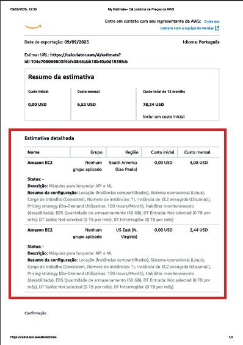

---

## 🚜 Entrega 1 — Machine Learning

### Objetivo
- Analisar a base `crop_yield.csv` (condições de solo, temperatura, umidade, precipitação).  
- Explorar tendências de rendimento com **clusterização (KMeans)**.  
- Criar **5 modelos preditivos de regressão** para estimar o rendimento.  

### Passos Realizados
1. **EDA (Exploratory Data Analysis)**  
   - `df.info()`, `df.describe()` e verificação de nulos.  
   - Histogramas, boxplots e scatterplots (ex.: temperatura × rendimento).  
   - Identificação de outliers.  

2. **Clusterização (Unsupervised)**  
   - Algoritmo **KMeans** (3 a 5 clusters).  
   - Dispersão colorida pelos clusters.  
   - Identificação de possíveis clusters de outliers.  

3. **Modelagem Preditiva (Supervised)**  
   - Modelos testados:  
     - Regressão Linear  
     - Decision Tree  
     - Random Forest  
     - Ridge / Lasso  
     - Gradient Boosting / XGBoost  
   - Avaliação com **R², RMSE, MAE**.  
   - Comparação final em tabela.  

4. **Conclusões**  
   - Insights do EDA.  
   - Clusters que representam cenários discrepantes.  
   - Modelo com melhor desempenho.  
   - Limitações (dataset pequeno, variáveis limitadas, ausência de tuning).  

📓 Notebook disponível em [`/notebooks/MarceloTadaieski_rm563731_pbl_fase5.ipynb`](./notebooks/MarceloTadaieski_rm563731_pbl_fase5.ipynb)  

🎥 **Vídeo da Entrega 1**: [link do YouTube aqui]  

---

## ☁️ Entrega 2 — Cloud AWS

### Objetivo
Estimar custos de hospedar a ML em uma **instância EC2** (On-Demand) com:  
- 2 vCPUs  
- 1 GiB RAM  
- 50 GB armazenamento  
- Rede até 5 Gbps  

### Comparação de custos entre regiões

| Região                  | Tipo da Instância | vCPUs | Memória | Armazenamento | Custo Mensal (USD) |
|--------------------------|------------------|-------|---------|---------------|---------------------|
| América do Sul (São Paulo) | t3.small         | 2     | 2 GiB   | 50 GB EBS     | **$4.08** |
| EUA Leste (N. Virginia)    | t3.small          | 2     | 2 GiB   | 50 GB EBS      | **$2.44** |

📸 Prints:  
- 

### Análise/Justificativa
**Cenário:** A API recebe dados de sensores em fazendas no Brasil e executa a inferência do modelo de ML. É necessário acessar rapidamente os dados dos sensores e há restrições legais para armazenamento no exterior.

**Comparação de custo (On-Demand, 2 vCPUs, ~2 GiB RAM, 50 GB EBS gp3)**
- América do Sul (São Paulo): **US$ 4,08/mês**
- EUA Leste (N. Virginia): **US$ 2,44/mês**
→ N. Virginia é ~**40%** mais barata.

**Acesso rápido aos dados (latência/throughput)**
- **Menor latência** entre sensores no Brasil e a API quando hospedada em **São Paulo** (rota doméstica/peering local), reduzindo atrasos de ingestão e resposta da inferência.
- **Menos variabilidade (jitter)** e rota mais curta → melhor estabilidade para streams/eventos dos sensores.
- **Menos hops internacionais** → menor chance de perda/retentativa, o que melhora o tempo de disponibilidade dos dados “quase em tempo real”.

**Restrições legais**
- O caso exige **armazenamento em território nacional**. Hospedar a solução (EC2 + EBS) em **São Paulo** atende a exigência; N. Virginia **não atende** ao requisito.

**Análise crítica – vantagens e trade-offs da solução escolhida (São Paulo)**
- ✅ **Compliance by design** (dados em repouso no Brasil).
- ✅ **Menor latência** de ingestão e de resposta para usuários/sensores no país.
- ✅ **Simplicidade operacional**: API e armazenamento na mesma região evitam transferência inter-regional.
- ⚠️ **Trade-off**: **custo mensal maior** (~40% acima de N. Virginia). Para mitigar, poderíamos (fora do escopo da atividade) considerar otimização de instância, desligamento fora de pico, compressão de payloads e, em cenários reais, descontos contratuais/reservas.
  
**Decisão**
> Mesmo sendo mais cara, a região **América do Sul (São Paulo)** é a **melhor opção** para este case, pois cumpre o requisito legal de armazenamento nacional e oferece melhor acesso (latência/estabilidade) aos dados dos sensores no Brasil.

🎥 **Vídeo da Entrega 2**: [https://youtu.be/p9gUNXpiuGk]  

